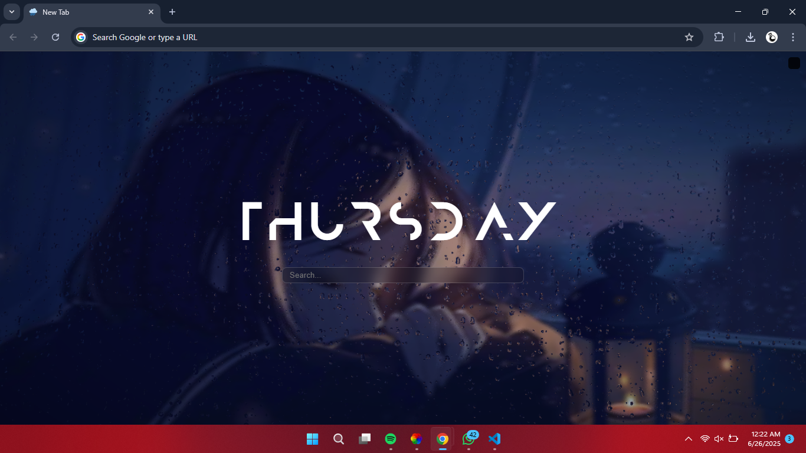

# Welcome this is an Open Source Chrome new Tab Extension
It's Free to use without Attribution you can modify and fork it
this project uses The Lively Wallpapers Rain Wallpaper so make sure to check them out

## You can do anything you can also distribute under our name or your name

* This Project uses Three.js for Rain Drops
* Feel Free to modify



## How to Mount Extension

* First Clone using
* Make Sure to have Git CLI or GitHub CLI installed on your System
  Git CLI
  ```
  git clone https://github.com/Waves-Lab-Offical/chrome
  ```
  or for GitHub CLI
  ```
  gh repo clone Waves-Lab-Offical/chrome
  ```

* First Navigate towards `chrome://extensions` and enable the toggle named Developer mode
* A menu for `Upload Unpacked`, `Pack extension` & `Update`
* Click on `Upload Unpacked` and navigate to where you cloned this repository
* and now open a new tab cancel the Warning to keep the new Tab

* Now you can even modify it Or use it
* Thanks
